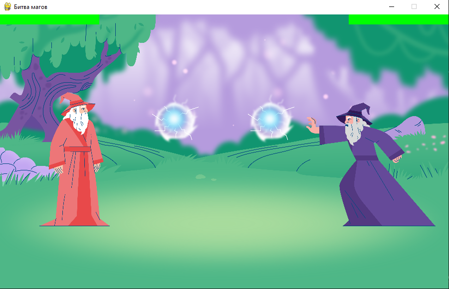

# Magic Fight
Учебный проект, созданный на Джанго, имитирующий работу магазина
## Что можно делать в игре
- Играть за мага
- Игратьв двоём
- Играть с роботом
## Чему научился 
- Вспомогательная функция для загрузки анимации для разных
персонажей
- Применение списковых включений и тернарных операторов
- Управление ботом. Постоянное дыхание, передвижение противника в зависимости от того, что делает игрок, и уворот, зависящий от действий игрока.
## Работа игры
### Меню игры

### Игра

